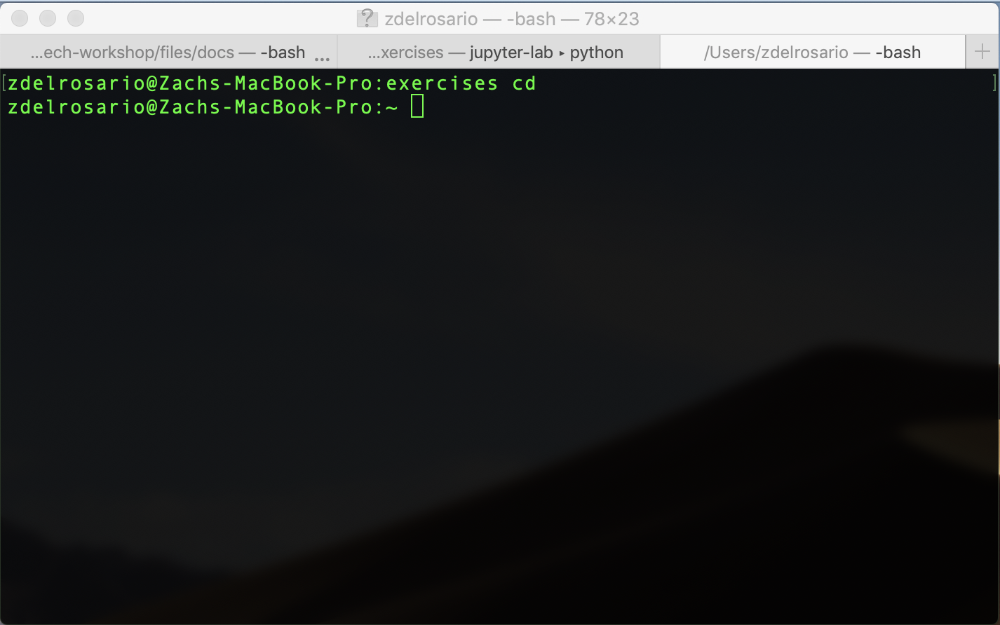
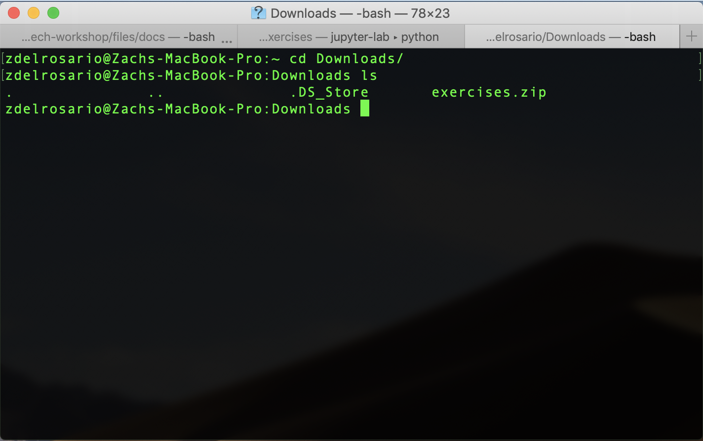
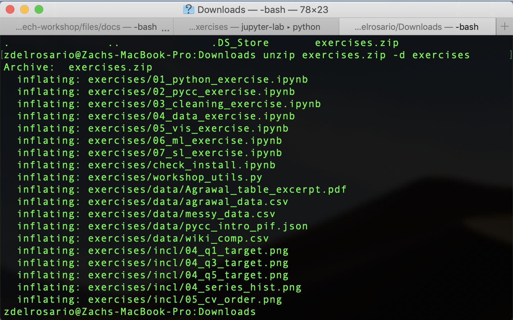
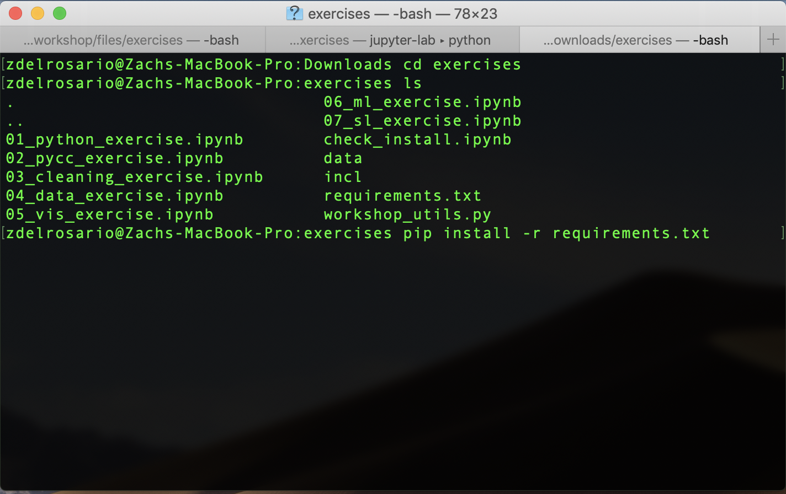

(setup)=
# Software Setup

In short, you'll need:

- Exercise files (Download)
- Python and Jupyter (Recommended: Anaconda)
- Tabula and WebPlotDigitizer (Free software)

**If you have any issues with these steps**: Please ask a TA! We will gladly
help you set up your environment.

## Exercises Files
<!-- ------------------------- -->

We will work through a number of programming exercises in this workshop. We have
consolidated the exercise notebooks and installation files in a single zip;
download the following and unzip.

- [Download this zip file](https://github.com/zdelrosario/mi101/raw/main/exercises.zip)

Save this to a stable location on your computer; for instance, your Documents folder.

## Python and Jupyter Installation
<!-- ------------------------- -->

We recommend [Anaconda
python](https://www.anaconda.com/distribution/#download-section), which will
provide *almost* everything you need. Make sure to install python version `>=
3.0`.

### Windows Installation
<!-- ------------------------- -->

If you are on Windows, you may need to install [Visual C++
Studio](https://go.microsoft.com/fwlink/?LinkId=691126). Click the
aforementioned link and install the tools.

## Tutorial: Using a Terminal
<!-- -------------------------------------------------- -->

Many software tools are most easily accessed through a programmatic interface
called a *terminal*. This section is a brief tutorial on using a terminal. We
will make minimal use of the terminal in this workshop, but it will be
absolutely essential for setting up your computer for the workshop. Please ask a
TA if you have any issues using a terminal.

### Opening a terminal

- Mac: `terminal.app` is your terminal -- you can find this through Spotlight
  search (Command + Spacebar).
- Windows: **After** you have installed Anaconda python, you will have access to
  `Anaconda prompt` -- use this as your terminal for the workshop.
- Linux: If you're on Linux, you probably already use a terminal regularly. On
  Ubuntu the shortcut to open a terminal is `Ctrl + Alt + T`.

After opening your terminal, you should see a window that looks something like
the following.



To use the terminal, you manually type commands, then press Enter to execute.

### Changing directory

When looking for files (Mac: Finder, Windows: Explorer, Linux: e.g. Nautilus),
we use a program to look at *directories*. Your terminal does something similar
-- at any point it is *located* in a particular *directory*. The following
screenshot illustrates `c`hanging `d`irectories (`cd`) to my `Downloads` folder,
then `l`i`s`ting (`ls`) the contents of said directory. This is where I placed
the `exercises.zip` archive for the workshop. (Note: On Windows, you must use
the command `dir`, rather than `ls`.)



I unzip the archive `exercises.zip` from within terminal with the command `unzip
exercises.zip -d exercises`, which results in the following:



I can then `cd` into the unzipped folder and install the required Python
packages with `pip install -r requirements.txt`. However, I can only do this
after I've installed Anaconda!

## Python Module Installation
<!-- ------------------------- -->

Once you have installed python, you will need to install a handful of python
modules to complete all the workshop exercises. Anaconda provides a package
installer called `pip`; from the command line, you can simply execute the
following commands.

In your terminal, change directory to where you unzipped the exercises,
and execute the command:

```
pip install -r requirements.txt
```

This will install the requirements for the workshop.



(open-jupyter)=
### Opening Jupyter Notebooks
<!-- ------------------------- -->

Jupyter notebooks are a particular way of working with Python code. They are
designated with the file extension `.ipynb`. Unfortunately, you cannot simply
double-click on a Jupyter notebook to open it. Instead, you must launch the
Jupyter client from your terminal. Navigate to the directory where you want
Jupyter to launch (for the workshop, this is where you unzipped the contents of
`exercises.zip`), and execute the command `jupyter notebook`.


This will open a webpage in your browser with a file explorer-like view; you can
then click on the notebooks in that directory to open them. Go ahead and open
`check_install.ipynb`, which you will run at the end of installation to check if
everything is set up correctly.

## Tabula
<!-- ------------------------- -->

[Tabula](https://tabula.technology) is a free program for *liberating* data from
PDF's. Please follow the previous link and install Tabula before the workshop.

## WebPlotDigitizer
<!-- ------------------------- -->

[WebPlotDigitizer](https://automeris.io/WebPlotDigitizer/) is a free program for
*extracting* data from images. Please follow the previous link and install
WebPlotDigitizer before the workshop.

## Final Check
<!-- -------------------------------------------------- -->

To check that you've successfully set up your computer for the workshop, please
run the following jupyter notebook.

```{admonition} Test your installation
Download and run
[check_install.ipynb](https://raw.githubusercontent.com/zdelrosario/mi101/main/mi101/notebooks/check_install.ipynb).
This is also included in the `exercises.zip` file above.

Navigate to the folder where you downloaded `check_install.ipynb`,
execute the command `jupyter notebook`, open `check_install.ipynb`,
and click on `Cells > Run All`. If you can successfully run the
notebook (without errors), then you are ready for the workshop!
```
